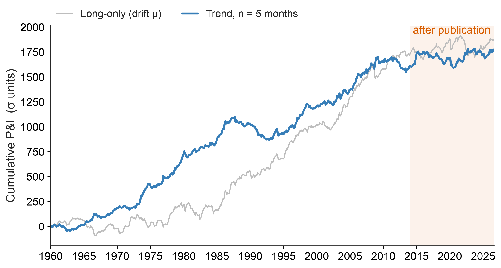
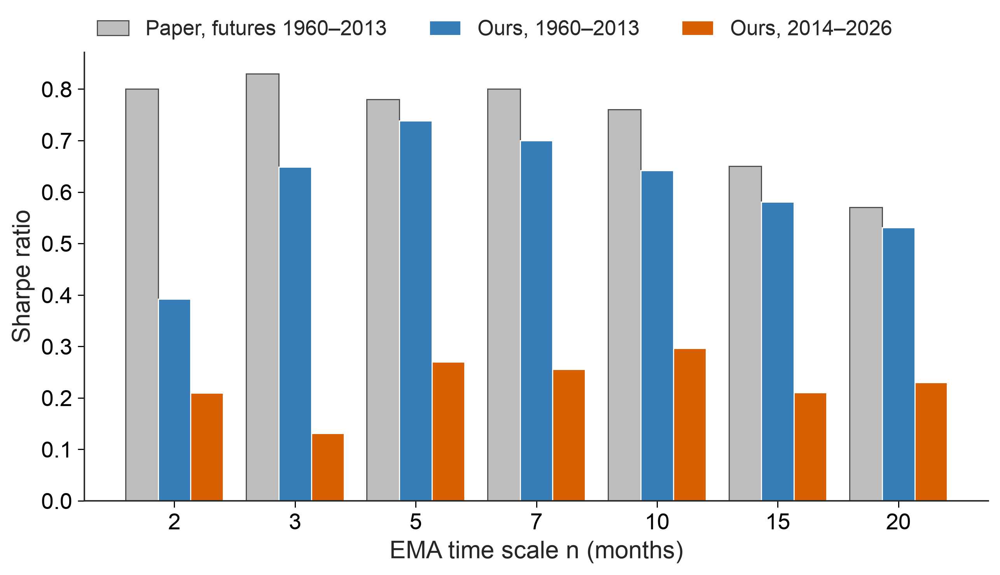
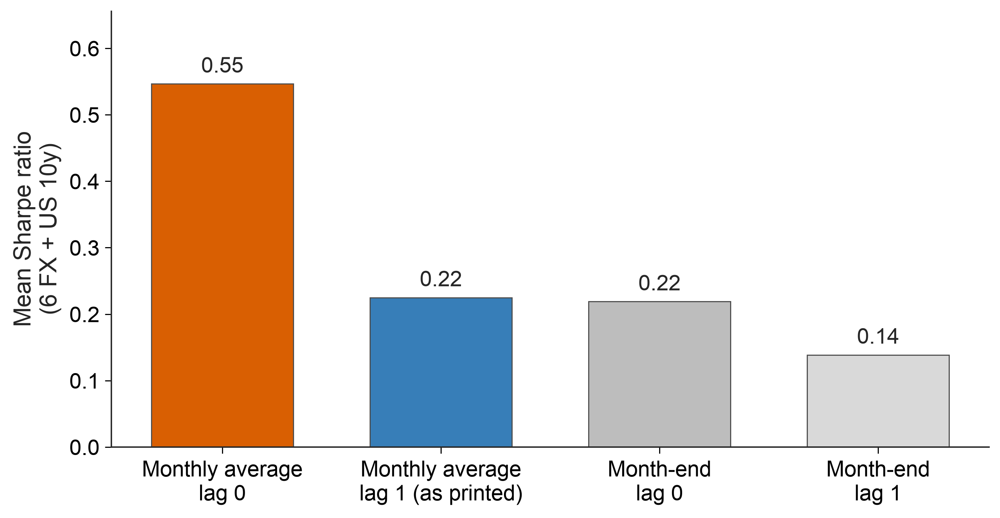
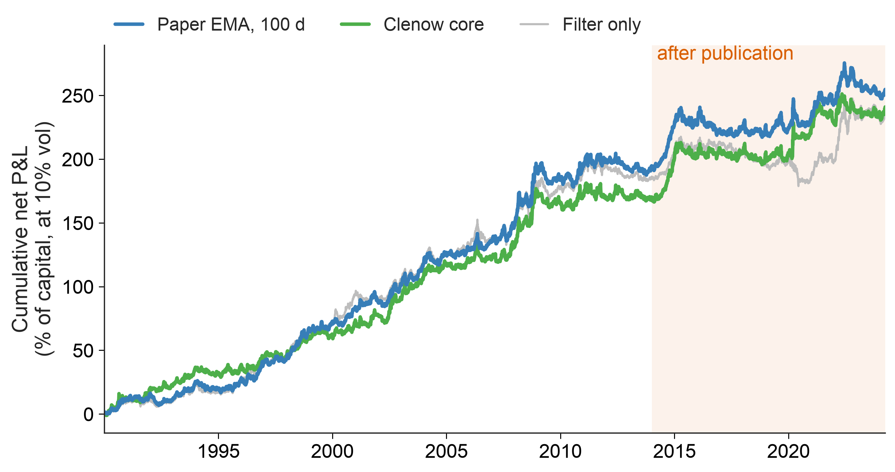
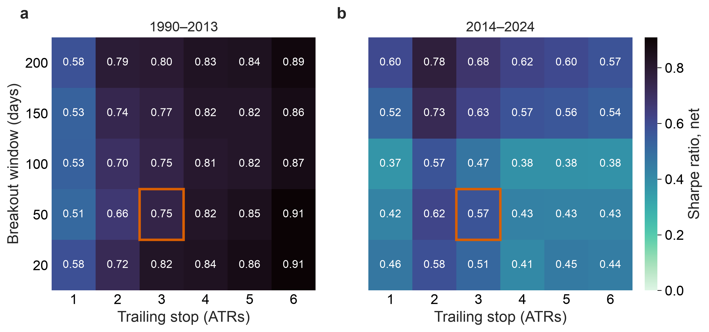
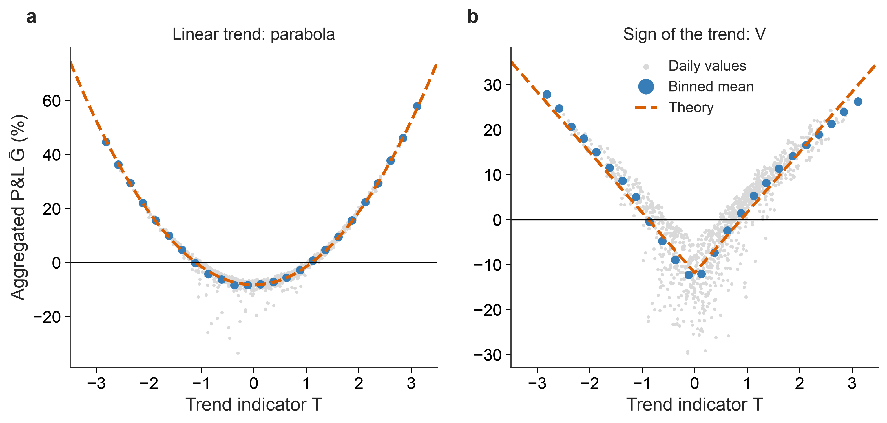
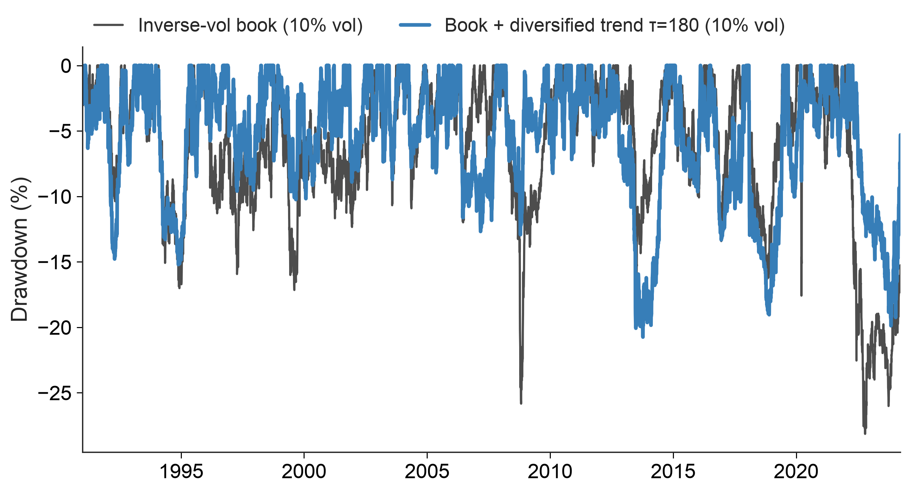

# Trend following: replication, practitioner rules and tail protection

[](https://github.com/lwang-genomics/trend-following-replication/actions/workflows/ci.yml)


**Part I** replicates **Lempérière, Deremble, Seager, Potters & Bouchaud (2014), "Two centuries of trend following"**
([arXiv:1404.3274](https://arxiv.org/abs/1404.3274)) using only **free public data** (FRED/OECD, World Bank, Shiller),
then runs the test a published result invites: **did it hold in the twelve years after publication?**

**Part II** puts the practitioner's version next to it: the core model of A. Clenow's *Following the Trend* (2013),
with a moving-average filter, breakout entries, an ATR trailing stop and volatility sizing. It runs on **62 daily
back-adjusted futures, net of costs**, alongside the paper's signal on the same data. **Is the practitioner's rule
better, or is it the same bet?**

**Part III** tests the follow-up paper by the same group, **Dao et al. (2016), "Tail protection for long investors:
trend convexity at work"** ([arXiv:1607.02410](https://arxiv.org/abs/1607.02410)). It then uses trend as an overlay on
the inverse-volatility portfolio of the companion study
[inverse-vol-futures-overlay](https://github.com/lwang-genomics/inverse-vol-futures-overlay). **What is trend's
convexity worth to a long-only investor, and how does it compare with buying puts?**

📄 **Report:** [`report/trend_following_replication.pdf`](report/trend_following_replication.pdf)

---

## Findings

**Part I: the paper on free monthly data**

| | Result |
|---|---|
| **Replicates** | 1960–2013, 27 markets, n = 5 months: Sharpe **0.74** (paper 0.78), t = **5.4** (5.7), drift-removed t\* = **4.5** (5.0). Correlation with the long-only drift is 0.18 (paper 0.15). |
| **Sectors** | Currencies (0.53 vs 0.57) and bonds (0.45 vs 0.49) match. Commodities are much weaker on spot prices (0.17 vs 0.80); Part II shows this is mostly a data effect rather than missing carry. |
| **Saturation** | A tanh fit of the next move on the signal saturates at s\* = 1.01 (paper 0.89) and beats the linear fit (F = 11). The cubic term is negative, as reported. |
| **After publication** | 2014–2026: Sharpe **0.27** (t = 1.0). That's weaker, but a bootstrap of the in-sample history gives a 9% chance of a period this weak, so the effect is not statistically rejected. |
| **150 years of US data** | Trend on US equities (from 1873) and bonds (from 1953): Sharpe 0.45, t = 5.5, positive in every 50-year block. |

**Part II: Clenow's rules vs the paper's signal, daily futures 1990 to March 2024**

| | Result |
|---|---|
| **Both work** | Net Sharpe ratio for 1990–2013: Clenow core **0.75**, paper's EMA signal (100 days) **0.86**. For 2014–24: **0.57** and **0.48**. A paired block bootstrap cannot tell them apart in either period. |
| **Same bet** | Monthly correlation is 0.83. The paper's signal explains 69% of Clenow's monthly variance; neither has a significant alpha over the other (t = 0.4 and 1.8). |
| **What the stop does** | It does not add edge, but it changes the shape. The model is in the market 48% of the time; at equal volatility its max drawdown is −21% vs −28%, and monthly skew 0.84 vs 0.36. The 50/100-day EMA filter alone earns as much as the full model. |
| **Parameters** | All 30 breakout and stop settings are profitable before and after 2014 (Sharpe 0.51–0.91, then 0.37–0.78). The in-sample ranking does not predict the later one (rank correlation −0.20), so there is nothing to tune. |
| **A real fund** | The two rules explain 62% of the monthly variance of a public managed-futures fund (AQMIX, 2010–2024). |
| **Back to Part I** | Part I's weak commodities (0.17 vs the paper's 0.80) are mostly a data effect. On the same 7 commodities, the same months, the trend Sharpe is 0.19 on averaged spot, 0.32 on futures with the same one-month delay, and 0.72 on month-end futures without it. |

**Part III: trend convexity and tail protection**

| | Result |
|---|---|
| **The mechanics replicate exactly** | The paper's identity (trend P&L = long-term minus short-term variance) holds to machine precision. On S&P 500 futures the aggregated P&L is the predicted parabola: curvature 0.0680 vs 0.0675 in theory, R² = 0.96. The sign rule gives the predicted V. |
| **Convexity in a real fund is weaker** | A simple 62-futures replicator is 0.79 correlated with a public managed-futures fund (AQMIX) at the paper's τ = 180 days. Measured at the right horizon, the fund's convexity against the S&P 500 rises from R² = 0.04 to 0.10, less than the paper's 0.02 → 0.18 on the SG CTA Index. |
| **Risk-parity bound** | The paper's lower bound for a diversified trend against an equal-risk portfolio holds on every one of 5,434 days. |
| **Overlay on the inverse-vol book** | At equal 10% volatility, a diversified slow trend overlay (1991–2024) raises the Sharpe ratio from 0.66 to 0.99. Max drawdown falls from −28% to −21%, and quarterly skew goes from −0.71 to +0.12. In 2022 the book lost 27% and the overlay made 32%. |
| **Not a put** | On average the overlay earns more when the book does well. Its protection covers bear markets that unfold over months (2000–02, 2008, 2022), not few-week crashes: in COVID a 40-day trend helped, the 180-day one much less. |
| **Puts vs trend** | Monthly 5% S&P 500 puts (CBOE PPUT) cost 3.7% a year and protected best in March 2020. Implied variance exceeded the variance realised afterwards in 85% of months. As the paper puts it: options are the better hedge, trend the cheaper one. |

<p align="center">
  <br>
  <em>Aggregate trend P&L (n = 5, σ units) vs the long-only drift; shaded: after publication.</em>
</p>

<p align="center">
  <br>
  <em>Sharpe ratio by EMA time scale: paper (futures), replication (1960–2013) and after publication.</em>
</p>

## Three data traps, and how they are handled

1. **Monthly averages fake a trend.** Most free series are monthly averages of daily prices. Averaging a random walk
   gives its monthly changes a lag-1 autocorrelation of 0.25 (Working, 1960), and the data show 0.25–0.35.
   - Trading the very next month on such data *doubles* the Sharpe ratio (0.55 vs 0.22) without any real edge.
   - The paper's eq. (2), read literally, holds the position one month later. That removes the artefact, and on
     markets with free month-end data it matches the realistic month-end result exactly (0.22 vs 0.22).
2. **Administered prices.** Grain support programmes and US oil price controls produce long stretches of unchanged
   prices, so σ shrinks to zero.
   - A single corn observation (January 1972, −467σ) cuts the 1960–2013 Sharpe ratio from 0.82 to 0.34.
   - Fix: a stale-price filter that trades only if the price moved in ≥ 10 of the last 12 months. It uses past data
     only, and the result is robust to the threshold.
3. **Interpolated history.** Shiller's long rate before 1953 is annual data interpolated to monthly (lag-1
   autocorrelation 0.92), which gave a fake bond-trend Sharpe of 2.0. The long-history bond starts in 1953.

<p align="center">
  <br>
  <em>Mean Sharpe ratio on 6 currencies + US 10y: monthly averages vs month-end closes, lag 0 vs lag 1.</em>
</p>

<p align="center">
  <br>
  <em>Part II: cumulative net P&L of Clenow's core model, the paper's signal and the EMA filter alone, each at 10% volatility.</em>
</p>

<p align="center">
  <br>
  <em>Part II: net Sharpe ratio of the core model across breakout windows and trailing stops; boxed: the book's setting.</em>
</p>

<p align="center">
  <br>
  <em>Part III: P&L of a trend on S&P 500 futures aggregated over ~90 days against the trend indicator: the predicted parabola (linear rule) and V (sign rule).</em>
</p>

<p align="center">
  <br>
  <em>Part III: drawdowns of the inverse-vol book alone and with a diversified trend overlay, both at 10% volatility.</em>
</p>

## Method

**Part I.** The signal and P&L follow the paper's eqs. (1)–(2):

```
s_n(t) = (p(t-1) − EMA_n[p](t-1)) / σ_n(t-1)         σ_n = EMA_n of |monthly price change|
Q_n(t) = Σ sign[s_n(t')] · (p(t'+1) − p(t')) / σ_n(t'-1)
```

- **Universe.** Stock indices, 10-year bonds and currencies for 7 countries (US, UK, Germany, Japan, Canada,
  Australia, Switzerland), plus 7 commodities: crude, natural gas, corn, wheat, sugar, cattle (beef proxy) and copper.
- **Statistics.** Sharpe and t = Sharpe·√years are computed as in the paper. The drift-removed t\* is the alpha
  t-stat from regressing the trend P&L on the long-only P&L. The out-of-sample test uses a block bootstrap.

**Part II.**
- **Data.** Daily Panama back-adjusted prices of 62 futures (equities, rates, currencies, energy, metals,
  agriculturals) from the open-source [pysystemtrade](https://github.com/pst-group/pysystemtrade) project, pinned to
  one commit. P&L is computed in price points, so it includes roll yield.
- **Clenow core model.** Trades long only while the 50-day EMA is above the 100-day EMA, and short only while below.
  Enters on a 50-day closing high or low, exits on a 3-ATR trailing stop, and sizes 0.2% of capital per ATR(100) at
  entry. The data have closes only; the true-range ATR is estimated as 1.9 × the mean |Δclose|, a ratio measured on 28
  futures with daily highs and lows.
- **Realism.** Positions trade at the next day's close. Costs are spread plus commission per contract, scaled with
  volatility, and every roll trades the position twice; costs are also tripled as a stress test.
- **Tests of "better or the same".** A paired block bootstrap of the Sharpe difference, spanning regressions, an
  ablation (filter, breakout, stop), a 30-point parameter grid split before and after 2014, and a comparison with a
  public managed-futures fund.

**Part III.**
- **Paper's definitions.** Returns normalised by a 10-day risk estimate, a linear EMA trend (τ = 180 days) or its
  sign, P&L aggregated over τ' ≈ 90 days, and the paper's trend indicator T.
- **Replicator.** Equal risk on the paper's list of liquid futures as available here (16 markets from 2002), and on
  the 62 futures of Part II. The SG CTA Index is not freely available, so AQMIX stands in for it.
- **Book.** The companion study's rules (inverse-vol weights, quarterly rebalancing, 10% vol target, 10 bp costs)
  on S&P 500, 10-year Treasury and gold futures. Overlays are traded at the next close with Part II's costs, and every
  combination is rescaled to 10% ex-ante volatility.
- **Options.** CBOE's 5% Put Protection Index (PPUT) and the VIX, against the S&P 500 total return.

## Reproduce

```bash
uv sync                   # Python 3.12 environment from uv.lock
uv run trendrep           # Part I: download data once (data/raw/), run everything, write results/ and figures/
uv run trendrep-daily     # Part II: daily futures (about a minute)
uv run trendrep-convexity # Part III: convexity, overlay and options (after Part II)
uv run trendrep-report    # compile the PDF report (Typst)
uv run pytest             # 30 tests, synthetic data only
```

Every figure is drawn twice from the same code: slide versions in `figures/` (shown in this README) and report
versions sized for the PDF in `figures/report/`.

The tests check the EMA and P&L against hand calculations and verify that there is **no look-ahead**. They also
check that random walks give t-stats centred on zero with unit spread, that **monthly averaging fakes a trend at
lag 0 but not at lag 1**, that trending series are profitable, that stale prices are not traded, and that the
saturation fit and de-biasing recover known parameters. For Part II they check every entry, exit and holding day of
the core model against its rules, the execution lag and cost accounting, no look-ahead for every rule, no edge on
random walks, and profits on persistent trends. For Part III they check the trend identity exactly on fat-tailed
returns, the parabola and V on random walks, the risk-parity bound on every simulated day, the book's volatility
target, and that risk estimates and volatility scaling use past data only.

## Code

```
src/trendrep/
  config.py    universe, sources, start dates (with reasons), parameters, the paper's published values
  data.py      FRED / World Bank / Shiller download and cache, bond prices from yields, month-end panel
  signal.py    the paper's signal and P&L, stale-price filter
  analysis.py  Sharpe, t, de-biased t*, saturation (tanh) fit, out-of-sample test, bootstrap, spanning regressions
  study.py     Part I: every table and figure
  futures.py   daily futures, percentage returns, costs, true-range calibration, benchmark fund, PPUT, VIX
  rules.py     Part II: Clenow's core model and its parts, the paper's signal on daily data, P&L and costs
  daily.py     Part II: every table and figure
  convexity.py Part III: the paper's EMA operator, normalised returns, trend P&L, identity and theory curves
  book.py      Part III: the inverse-vol book of the companion study, volatility scaling
  convexity_study.py  Part III: every table and figure
  plots.py     figures
```

## Limitations

- **Limitations, Part I:** spot and index proxies instead of futures, monthly averages for most series, no costs, and
  27 markets rather than a full CTA universe.
- **Limitations, Part II:** the data end in March 2024. The universe is today's listed contracts, so it carries some
  survivorship and selection. ATR is estimated from closes, and trades happen at the next close rather than the next
  open. Costs are today's, scaled by volatility. Positions are fractional and P&L is not compounded. The fund
  comparison uses a single fund.
- **Limitations, Part III:** one public fund instead of the SG CTA Index; gross P&L in the convexity analysis, as in
  the paper; the book is rebuilt on futures rather than the companion study's ETFs; the put comparison uses one listed
  strategy and is not risk-matched.

## Context

An independent study by Liangxi Wang, computational scientist (Genomics PhD), not affiliated with any employer,
the authors of the papers or the book. Implemented with AI-assisted coding (Claude Code). Research questions, design decisions,
data checks and interpretation are my own; all results are reproducible from the code. Research code, **not
investment advice**. Licence: MIT. Data are downloaded, not redistributed, and remain subject to their providers'
terms (pysystemtrade data: GPL-3).
