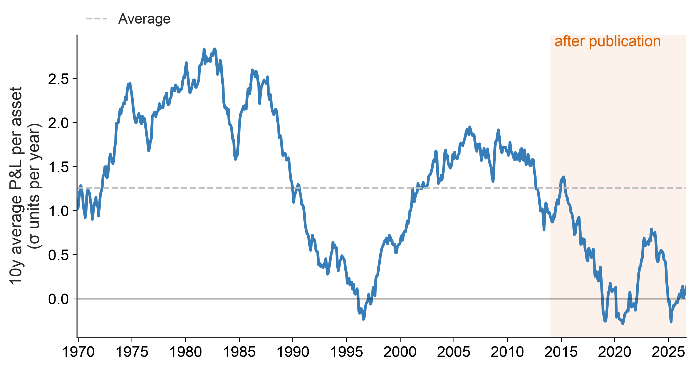
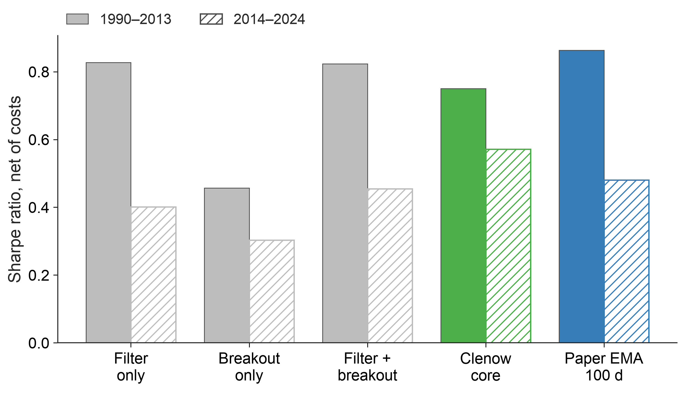
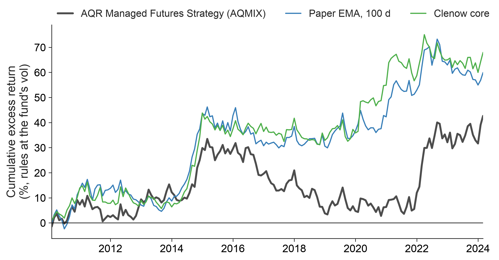
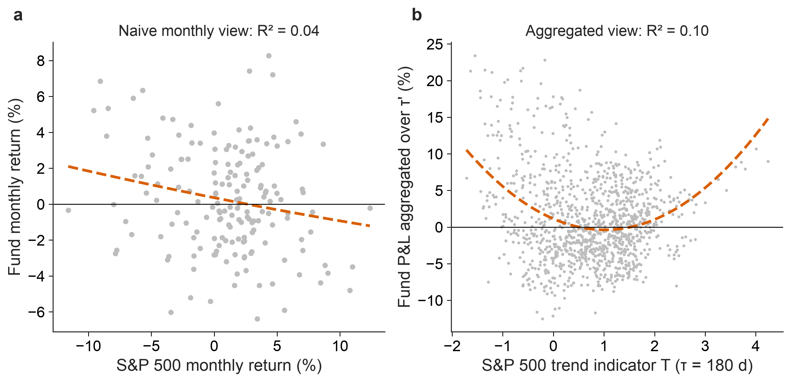
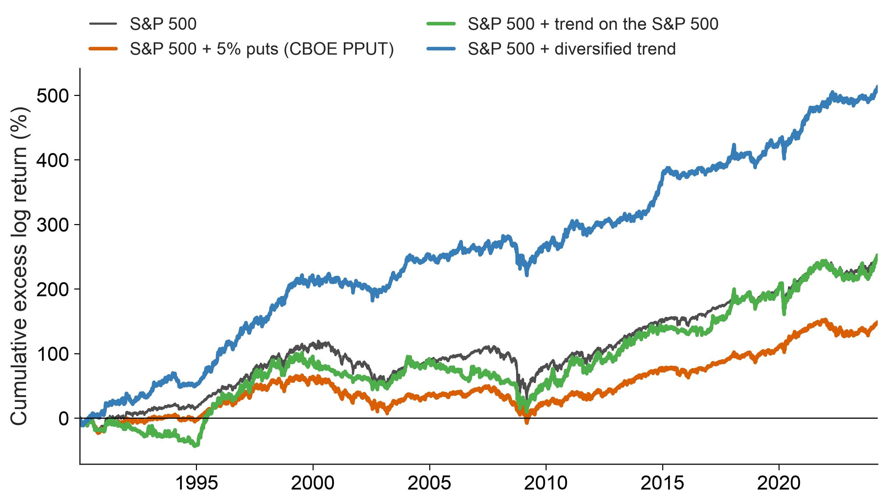

# Trend following: replication, practitioner rules and tail protection

[](https://github.com/lwang-genomics/trend-following-replication/actions/workflows/ci.yml)


Two papers by Capital Fund Management researchers on trend following, replicated on **free public data**, plus a
test of the practitioner's version from A. Clenow's *Following the Trend*.

📄 **Report:** [`report/trend_following_replication.pdf`](report/trend_following_replication.pdf)

| | Question | Answer |
|---|---|---|
| **I** | Does [Lempérière et al. (2014)](https://arxiv.org/abs/1404.3274) replicate, and did it hold after publication? | Yes: Sharpe **0.74** vs 0.78 published (1960–2013). Weaker after: **0.27** (2014–2026), but not statistically rejected. |
| **II** | Is Clenow's rule better than the paper's signal? (62 daily futures, net of costs) | No, it's the **same bet**: net Sharpe 0.75 vs 0.86, correlation 0.83. The stop changes drawdowns and skew, not the edge. |
| **III** | Does trend protect a long-only portfolio, as [Dao et al. (2016)](https://arxiv.org/abs/1607.02410) argue? | At equal risk it lifts the [inverse-vol book](https://github.com/lwang-genomics/inverse-vol-futures-overlay)'s Sharpe from **0.66 to 0.99**. It protects in slow bear markets, not in few-week crashes. |

---

## Part I: two centuries of trend, on free data

<table>
<tr>
<td width="50%"></td>
<td width="50%"></td>
</tr>
<tr>
<td><sub>Trend P&L on 27 markets vs the long-only drift; shaded: after publication.</sub></td>
<td><sub>Sharpe by EMA time scale: paper, replication, and after publication.</sub></td>
</tr>
<tr>
<td></td>
<td></td>
</tr>
<tr>
<td><sub><b>Data trap:</b> monthly averages fake a trend (0.55) unless the position is lagged (0.22 = month-end result).</sub></td>
<td><sub>Trailing 10-year performance: the paper's "never negative" claim does not hold on spot data.</sub></td>
</tr>
</table>

- t = 5.4 (paper 5.7), drift-removed t\* = 4.5 (5.0); the signal saturates as reported (s\* = 1.01 vs 0.89).
- Three data traps are documented and handled: monthly averaging, administered prices (a single 1972 corn
  observation cuts the Sharpe from 0.82 to 0.34) and interpolated history.

## Part II: Clenow's rules vs the paper's signal

<table>
<tr>
<td width="50%"></td>
<td width="50%"></td>
</tr>
<tr>
<td><sub>Net P&L at 10% volatility, 1990–2024: the two rules move together.</sub></td>
<td><sub>What each component adds: the EMA filter alone carries the edge.</sub></td>
</tr>
<tr>
<td></td>
<td></td>
</tr>
<tr>
<td><sub>30 parameter settings, all profitable; the best before 2014 were not the best after. Boxed: the book's setting.</sub></td>
<td><sub>A public managed-futures fund (AQMIX): the two rules explain 62% of its monthly variance.</sub></td>
</tr>
</table>

- Neither rule has a significant alpha over the other (t = 0.4 and 1.8). At equal risk Clenow's model has a smaller
  worst drawdown than the paper's signal (−21% vs −28%) and more positive monthly skew (0.84 vs 0.36).
- Part I's weak commodities are mostly a data effect: on the same seven commodities the trend Sharpe is 0.19 on
  averaged spot prices and 0.72 on month-end futures.

## Part III: trend convexity and tail protection

<table>
<tr>
<td width="50%"></td>
<td width="50%"></td>
</tr>
<tr>
<td><sub>S&P 500 futures: trend P&L is the predicted parabola (linear rule) and V (sign rule).</sub></td>
<td><sub>A real fund is convex in the S&P 500 only at the right horizon (R² 0.04 → 0.10).</sub></td>
</tr>
<tr>
<td></td>
<td></td>
</tr>
<tr>
<td><sub>The inverse-vol book with and without a trend overlay, both at 10% volatility.</sub></td>
<td><sub>Protection compared: monthly 5% puts (CBOE PPUT) vs trend overlays.</sub></td>
</tr>
</table>

- The paper's identity (trend P&L = long-term minus short-term variance) holds to machine precision, and its
  risk-parity bound holds on every one of 5,434 days.
- In 2022 the book lost 27% and the overlay made 32%. In the five-week COVID crash a fast (40-day) trend helped far
  more than the 180-day one (+25% vs +8%), and puts protected best, at a cost of 3.7% a year: options are the better
  hedge, trend the cheaper one.

---

## Reproduce

```bash
uv sync                   # Python 3.12 environment from uv.lock
uv run trendrep           # Part I (downloads data once into data/raw/)
uv run trendrep-daily     # Part II
uv run trendrep-convexity # Part III
uv run trendrep-report    # compile the PDF report
uv run pytest             # 30 tests on synthetic data
```

<details>
<summary><b>Method</b></summary>

**Part I.** The paper's eqs. (1)–(2): `s_n(t) = (p(t-1) − EMA_n[p](t-1)) / σ_n(t-1)`, position `sign(s)`,
risk-normalised P&L, n = 5 months, held one month after the signal as printed. Indices, 10-year bonds and
currencies of 7 countries plus 7 commodities, from FRED/OECD, the World Bank and Shiller.

**Part II.** 62 daily back-adjusted futures from the open-source
[pysystemtrade](https://github.com/pst-group/pysystemtrade) project, pinned to one commit (data to March 2024).
Clenow's core model: 50/100-day EMA filter, 50-day breakout entry, 3-ATR trailing stop, 0.2% risk per ATR. The ATR
is estimated from closes as 1.9 × the mean |Δclose|, a ratio measured on futures with daily highs and lows. Trades
happen at the next close, with spread, commission and roll costs, also tripled as a stress test.

**Part III.** The paper's definitions (10-day risk normalisation, linear EMA trend at τ = 180 days, P&L aggregated
over τ' ≈ 90 days). AQMIX stands in for the SG CTA Index, which is not freely available. The inverse-vol book uses
the companion study's rules on S&P 500, Treasury and gold futures, and every combination is rescaled to 10%
ex-ante volatility.

</details>

<details>
<summary><b>Tests</b></summary>

EMA and P&L against hand calculations; **no look-ahead** for every rule; t-stats centred on zero for random walks;
monthly averaging fakes a trend at lag 0 but not at lag 1; stale prices are not traded; every entry, exit and
holding day of Clenow's model against its rules; cost accounting; the trend identity exactly on fat-tailed returns;
the parabola and V on random walks; the risk-parity bound on every simulated day.

</details>

<details>
<summary><b>Code</b></summary>

```
src/trendrep/
  config.py           universe, sources, parameters, the papers' published values
  data.py             FRED / World Bank / Shiller data, bond prices from yields
  signal.py           the paper's signal and P&L, stale-price filter
  analysis.py         Sharpe, t, de-biased t*, saturation fit, bootstrap, spanning regressions
  study.py            Part I
  futures.py          daily futures, costs, true-range calibration, benchmark fund, PPUT, VIX
  rules.py            Clenow's core model and its parts, the paper's signal on daily data
  daily.py            Part II
  convexity.py        the paper's EMA operator, trend identity and theory curves
  book.py             the inverse-vol book of the companion study
  convexity_study.py  Part III
  plots.py            figures: slide versions in figures/, report versions in figures/report/
```

</details>

<details>
<summary><b>Limitations</b></summary>

- **Part I:** spot and index proxies instead of futures, monthly averages for most series, no costs.
- **Part II:** data end in March 2024; today's listed contracts (some survivorship); ATR estimated from closes;
  next-close execution; today's costs scaled by volatility; fractional positions, P&L not compounded.
- **Part III:** one public fund instead of the SG CTA Index; gross P&L in the convexity analysis, as in the paper;
  the put comparison uses one listed strategy and is not risk-matched.

</details>

---

An independent study by Liangxi Wang, computational scientist (Genomics PhD), not affiliated with any employer, the
authors of the papers or the book. Implemented with AI-assisted coding (Claude Code); research questions, design
decisions, data checks and interpretation are my own. Research code, **not investment advice**. MIT licence. Data are
downloaded, not redistributed, and remain subject to their providers' terms (pysystemtrade data: GPL-3).
